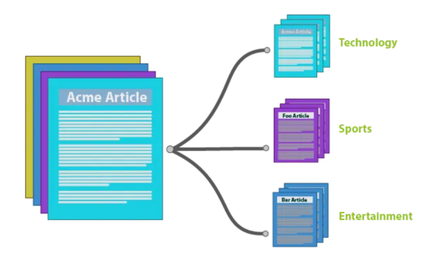

  

<h1> KLUE Topic Classification </h1> 

<!-- END doctoc generated TOC please keep comment here to allow auto update -->

## Introduction

  

주제 분류(Topic Classification, TC)는 자연어 문장을 주제가 해당하는 카테고리로 분류하는, 모델의 자연어에 대한 이해를 평가할 수 있는 간단한 task 입니다. 본 프로젝트에서 사용하는 KLUE-TC 벤치마크는 뉴스의 제목을 정치, 사회, 경제 등을 포함한 7개의 주제로 분류한 데이터셋을 사용합니다. 특히 이번 프로젝트는 Data-Centric 프로젝트로서, 베이스라인 모델의 수정 없이 데이터의 개선만으로 성능 향상을 이끌어내는 것이 목표입니다. 데이터는 7,000개의 학습 데이터와 47,785개의 테스트 데이터로 이루어져 있으며, 각 데이터에는 문장에 대한 Graphemes to Phoneme(G2P) noise와 target을 임의로 변경한 labeling error 데이터가 포함되어 있습니다. 이때 개별 데이터의 feature는 각 데이터 샘플의 식별자인 `ID`, 분류 대상이 되는 자연어 텍스트(기사 제목)에 해당하는 `text`, 정수로 인코딩된 label인 `target`, 데이터 샘플의 뉴스 url인 `url`, 데이터 샘플의 작성 날짜와 시간인 `date`로 구성되어 있으며, `url`의 경우 어떤 형태로든 학습에 활용하는 것이 제한됩니다.

## Features

* EDA
* g2pK
* CleanLab
* Back Translatoin
* Masked Language Modeling Data Augmentation 
* Synthetic Data Generation (T5)
* Contextual Word Embeddings Augmentation (nlapug)
* NAVER News crawling
* Custom W&B Logger

## Contributors

<table align='center'>
  <tr>
    <td align="center">
       
          
    </td>
    <td align="center">
       
          
    </td>
    <td align="center">
       
      
    </td>
    <td align="center">
       
      
    </td>
    <td align="center">
       
      
    </td>
    <td align="center">
       
       
    </td>
  </tr>
</table>

## Reference
[1] Grootendorst, M. (2022). BERTopic: Neural topic modeling with a class-based TF-IDF procedure. Retrieved from https://maartengr.github.io/BERTopic/index.html  
[2] Park, K. (n.d.). g2pK: g2p module for Korean. GitHub. Retrieved from https://github.com/Kyubyong/g2pK  
[3] Northcutt, C., Jiang, L., & Chuang, I. (2021). Confident learning: Estimating uncertainty in dataset labels. Journal of Artificial Intelligence Research, 70, 1373-1411.  
[4] 김기훈, 이창기, 류지희, & 임준호. (2020). 한국어 상호참조해결을 위한 BERT 기반 데이터 증강 기법. 제32회 한글 및 한국어 정보처리 학술대회. https://koreascience.kr/article/CFKO202030060835857.pdf   
[5] Raffel, C., Shazeer, N., Roberts, A., Lee, K., Narang, S., Matena, M., ... & Liu, P. J. (2020). Exploring the limits of transfer learning with a unified text-to-text transformer. The Journal of Machine Learning Research, 21(1), 5485-5551. Retrieved from https://arxiv.org/abs/1910.10683  
[6] Ma, E. (2023). nlpaug: A Python library for augmenting natural language for machine learning. GitHub. Retrieved from https://github.com/makcedward/nlpaug  
[7] AI Hub. (2024). 뉴스 기사 기계독해 데이터. AI Hub. https://www.aihub.or.kr/aihubdata/data/view.do?currMenu=115&topMenu=100&aihubDataSe=data&dataSetSn=577  
[8] Weights & Biases. (n.d.). Custom logging: Log and view evaluation samples during training. Hugging Face Transformers | Weights & Biases Documentation. Retrieved from  https://docs.wandb.ai/guides/integrations/huggingface#custom-logging-log-and-view-evaluation-samples-during-training   
